# Bloggers' Hub

## Project Introduction

Bloggers' Hub is a modern, responsive website for bloggers to share, read, and interact with blog posts. The site features a dynamic blog page with authentication, interactive post filtering and searching, a home page with an about section, and a contact section with an embedded Google Map and contact details. The project demonstrates comprehensive use of HTML, CSS, and JavaScript for a seamless user experience.

## Project Structure

```
index.html
blog.html
success.html
README.md
static/
    script.js
    images/
    css/
        style.css
```

- **[index.html](index.html)**: Main HTML file for the Home page, including About and Contact sections.
- **[blog.html](blog.html)**: Blog page for creating, viewing, searching, and interacting with blog posts. Includes authentication modal and role-based permissions.
- **[success.html](success.html)**: Success page shown after submitting the contact form, with a personalized thank you message.
- **[static/script.js](static/script.js)**: JavaScript for all interactivity (authentication, blog rendering, filtering, likes, comments, modals, dark mode, navigation, and contact form handling).
- **[static/css/style.css](static/css/style.css)**: CSS for layout, responsiveness, dark mode, and all UI components.
- **README.md**: Project documentation and usage instructions.

## Key Features

- Responsive navigation bar with burger menu for mobile devices
- Home page with About and Contact sections
- Embedded Google Map and clickable contact information
- Dynamic blog page with:
  - Authentication modal (user/admin roles. "admin password = "Mobolaji")
  - Blog post creation and listing (rendered from JavaScript data)
  - Real-time search functionality (modal displays all matching blog titles)
  - Like and comment features for each post
  - Modal view for blog search results and navigation
  - Role-based permissions for deleting posts and comments (only authors or admins)
- Dark mode toggle (works on all pages)
- Accessible and semantic HTML structure
- Modern JavaScript (ES6+) and best practices

## Screenshots
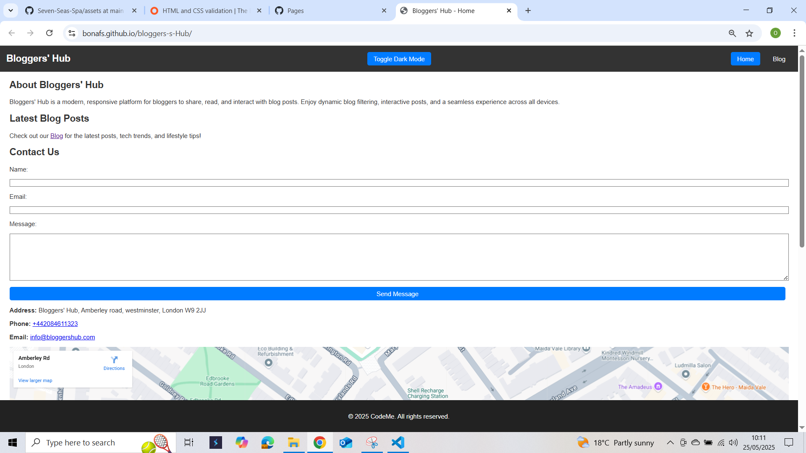


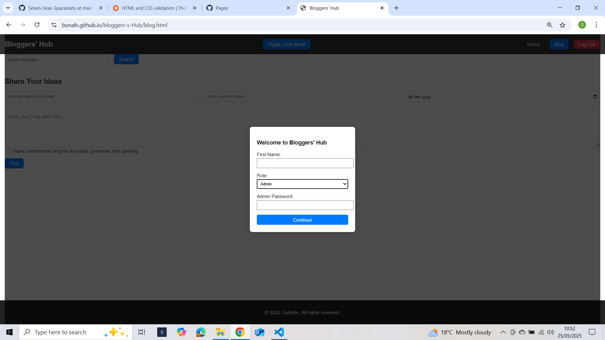

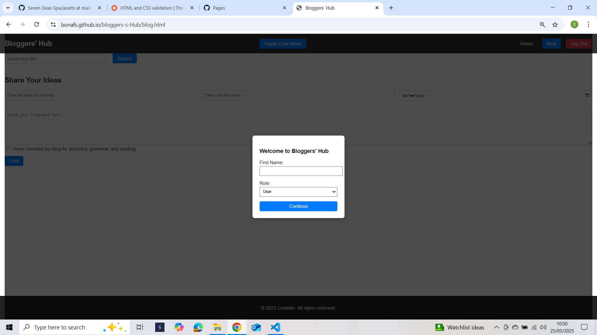

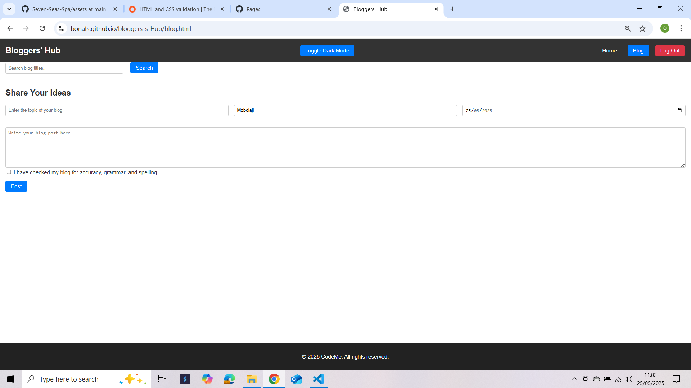

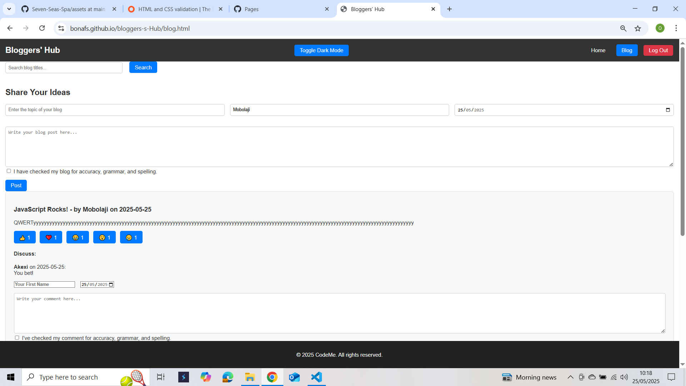

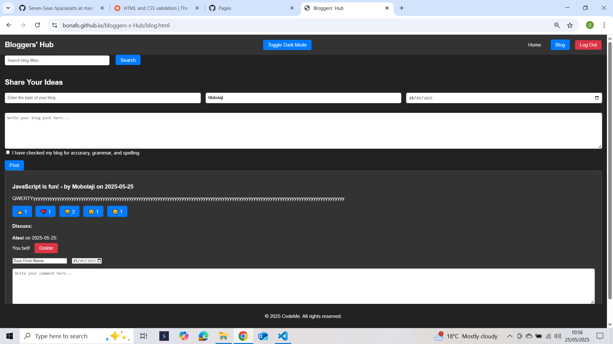

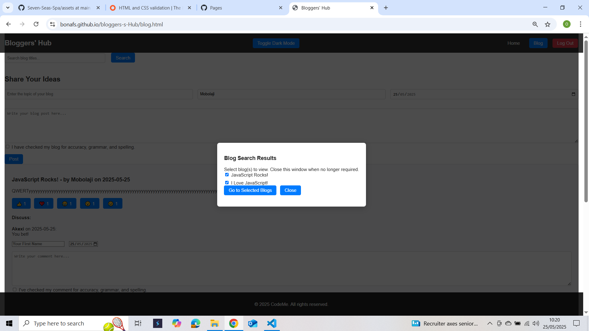

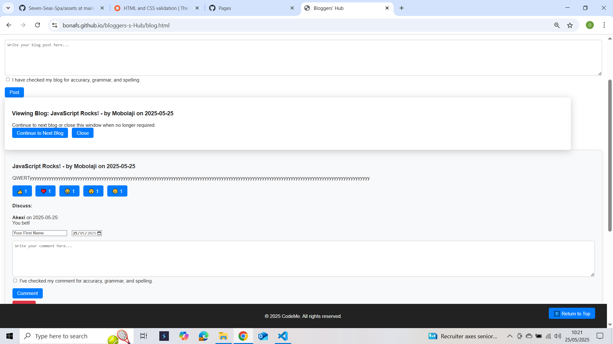

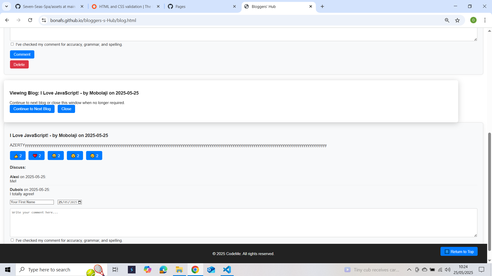

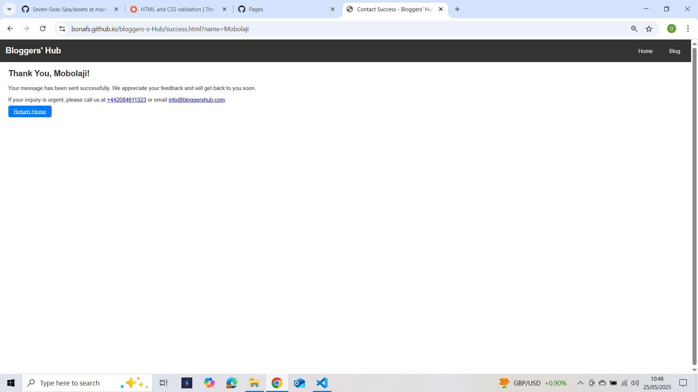


## Usage Instructions

1. **Clone or download the repository.**
2. **Open `index.html` in your browser to view the Home page.**
3. **Use the navigation bar to switch between Home and Blog pages.**
4. **On the Blog page:**
   - Authenticate as a user or admin (admin password: `Mobolaji`).
   - Use the search bar to find posts by title (all matches are shown in a modal).
   - Create new blog posts and interact with existing ones (like, comment).
   - Only the post/comment author or an admin can delete posts/comments.
   - Use the modal to navigate between search results.
5. **Use the dark mode toggle in the navigation bar for a different viewing experience.**
6. **On mobile, use the burger menu to access navigation links.**
7. **Submit the contact form on the Home page to see a personalized thank you message on the success page.**
8. **Use the Log Out button on the Blog page to end your session.**

## File Linking and References

- The stylesheet is linked in `index.html` and `blog.html` as:
  ```html
  <link rel="stylesheet" href="static/css/style.css">
  ```
- The JavaScript is linked in `index.html` and `blog.html` as:
  ```html
  <script src="static/script.js" defer></script>
  ```
- All navigation and resource links use the above structure.

## Features & Implementation Details

### Navigation

- `<nav>` element present on every page.
- Links: Home, Blog.
- Current page is highlighted with `.active` class.
- Responsive burger menu for screens ≤768px, toggled via JavaScript.
- Log Out button on the Blog page for ending authenticated sessions.

### Home Page

- About section: Describes Bloggers' Hub and its features.
- Contact section: Shows address, clickable phone and email, and an embedded responsive Google Map.
- Contact form submission redirects to `success.html` with a personalized thank you message.

### Blog Page

- Authentication modal appears if not logged in (user/admin roles).
- Blog posts are rendered dynamically from JavaScript in [`static/script.js`](static/script.js).
- Each post displays title, author, date, and content.
- Real-time search input allows searching blog titles; all matches are shown in a modal for selection and navigation.
- Like buttons increment count and update UI instantly.
- Comment section allows adding comments to each post.
- Only the author or an admin can delete their own posts/comments.
- Modal is used for displaying and navigating search results, appearing above the selected blog post.
- "Return to Top" button appears when scrolling down.

### Responsiveness & Accessibility

- Layout adapts to all screen sizes using CSS Flexbox, Grid, and media queries.
- All interactive elements are accessible and styled for usability.
- No horizontal scrolling required on mobile.

### Dark Mode

- Toggle button in the navigation bar switches between light and dark themes.
- All components (posts, modals, forms) adapt to the selected theme.
- Dark mode toggle works on all pages.

### Code Quality

- HTML, CSS, and JS are separated into clearly named files.
- JavaScript uses ES6+ features (let/const, arrow functions, template literals).
- All interactivity is implemented in [`static/script.js`](static/script.js).
- Code is commented and follows best practices for readability and maintainability.

---

## Project File Structure

```
bloggers-s-Hub/
│
├── index.html
├── blog.html
├── success.html
├── README.md
└── static/
    ├── script.js
    └── css/
        └── style.css
```

- **index.html**: Main HTML file containing Home, About, and Contact sections.
- **blog.html**: Blog page for creating and interacting with posts (with authentication).
- **success.html**: Personalized thank you page after contact form submission.
- **static/css/style.css**: All styles for layout, responsiveness, dark mode, and UI components.
- **static/images**: All image files for Screenshots and Testing Screenshots.
- **static/script.js**: JavaScript for authentication, dynamic blog rendering, filtering, likes, comments, modal, dark mode, navigation, and contact form handling.
- **README.md**: This documentation file.

## Development & Contribution

- Keep all HTML in the appropriate `.html` files.
- Place all CSS in `static/css/style.css`.
- Place all JavaScript in `static/script.js`.
- Use semantic HTML and accessible ARIA attributes where appropriate.
- Follow ES6+ JavaScript standards and comment your code.
- Update this README.md with any structural or feature changes.

## Features Checklist

- [x] Responsive navigation bar with burger menu
- [x] Home, About, and Contact sections in `index.html`
- [x] Embedded Google Map and clickable contact info
- [x] Dynamic blog post creation, rendering, and searching
- [x] Like and comment features with real-time UI updates
- [x] Modal for blog search results and navigation
- [x] Dark mode toggle (all pages)
- [x] Authentication modal for blog page (user/admin roles)
- [x] Role-based permissions for deleting posts/comments
- [x] Accessible, semantic HTML structure
- [x] Modern, modular JavaScript (ES6+)
- [x] Comprehensive documentation## 

## Testing Screenshots
Home Page
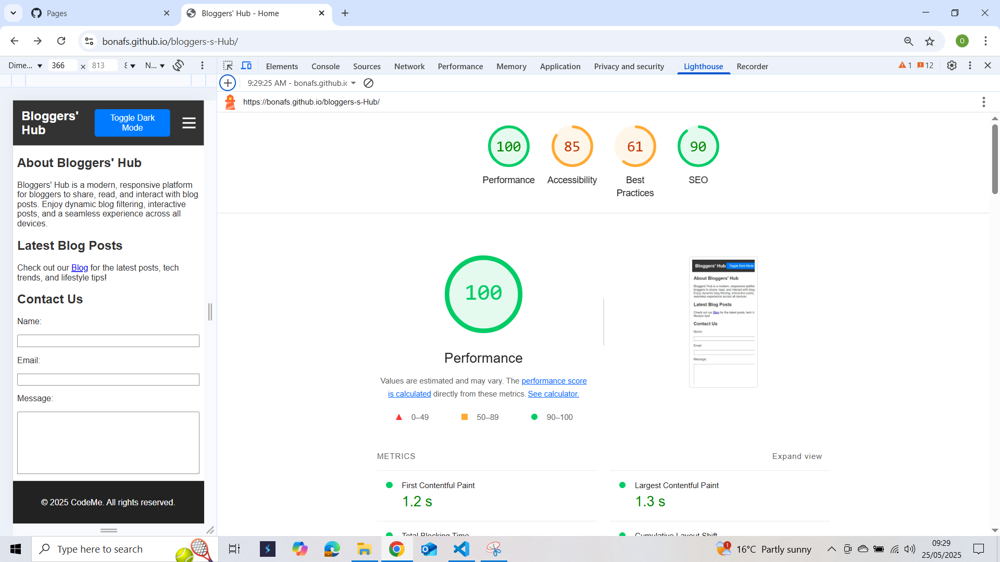

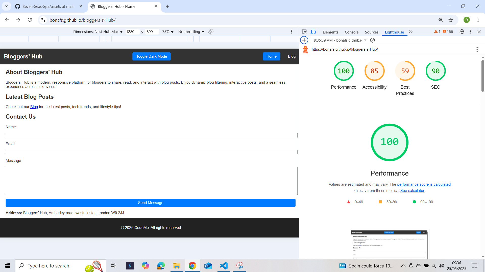

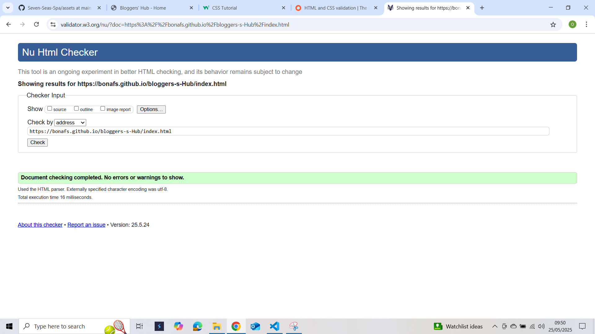

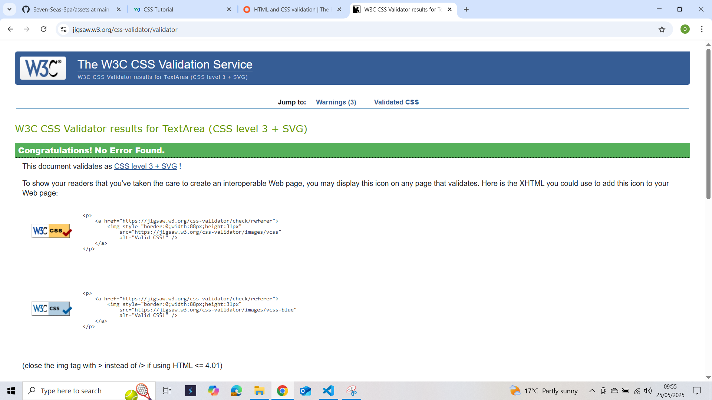

---

## License

Mobolaji Onafuwa.  
Full Stack Developer (AI-Augmented.)  
Copyright 2025.